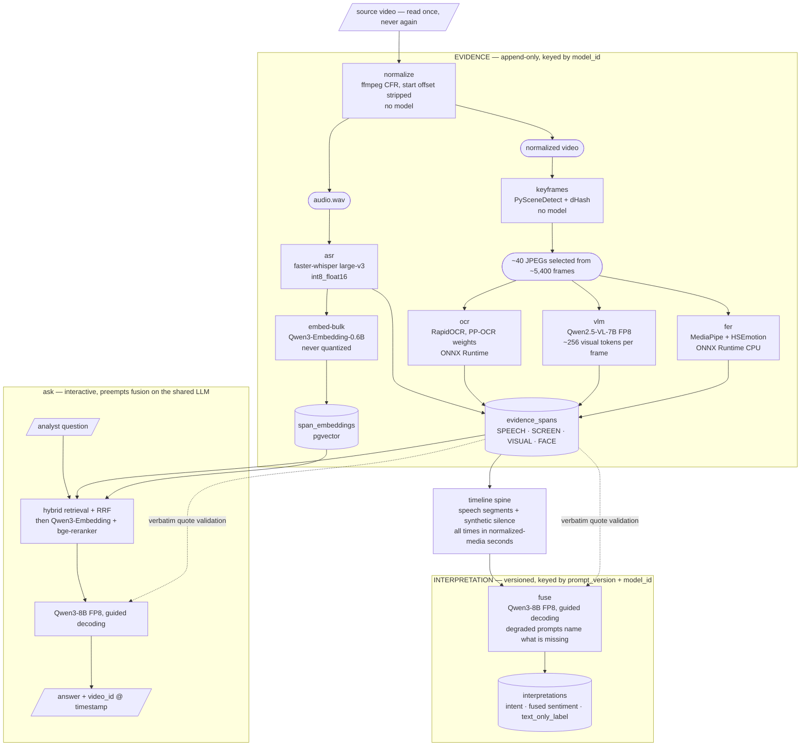
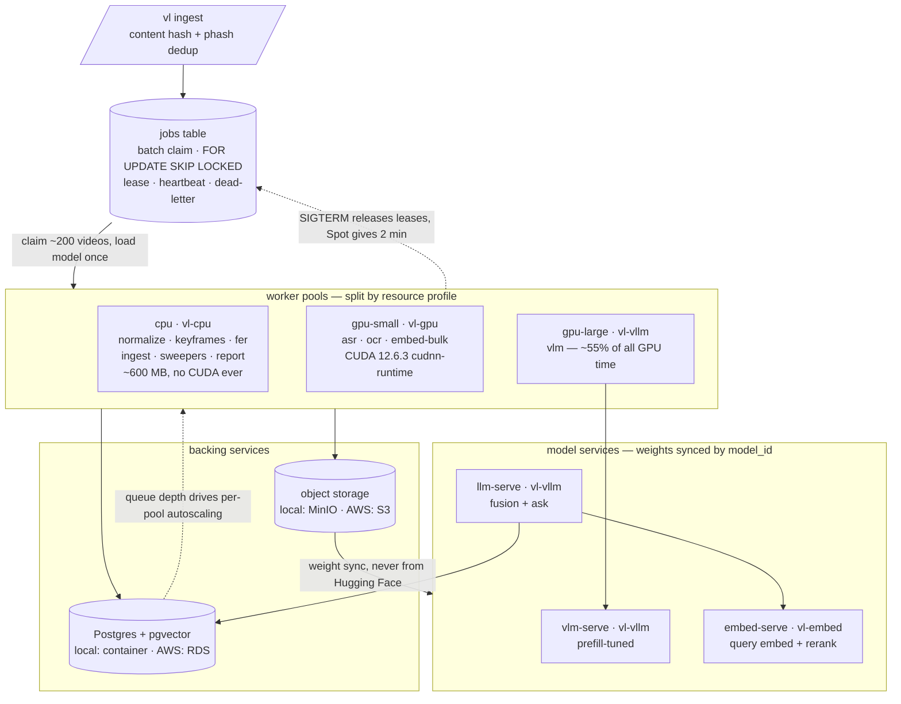

# Video Listening

Turns raw video into a queryable corpus of Voice-of-the-Customer evidence.

Social listening and call-center analytics operate on text: reviews, tickets, transcripts. Video-native customer feedback — TikTok/Reels product reviews, user-research recordings, video support tickets — is a blind spot, because the signal lives in three streams at once (speech, visuals, on-screen text) and none of it is tagged.

This system extracts all three streams, aligns them on a single timeline, fuses them into one prompt for a self-hosted LLM, and stores the result as a permanent, searchable corpus. An analyst then asks questions in natural language:

```
$ vl ask "what are people saying about battery life since the v3 update?"

Battery complaints rose sharply after v3, concentrated on overnight drain
rather than heavy use. 14 videos mention it directly.

  vid_a81f @ 0:47   "it dies by noon and I barely touch it"
  vid_c024 @ 2:13   "I'm charging twice a day now, never used to"
  vid_9e3b @ 1:02   screen shows "Battery 12%" at 4h uptime
  … 11 more
```

Every claim is cited to a video and a timestamp. Open the video at that moment and the evidence is there.

## Who it's for

A brand or CX analyst. They monitor text today and sample video by hand. The goal is for them to see *"17 videos complain about the same bug this week"* now, instead of learning it from a support-ticket spike a month later.

## The core idea: evidence vs. interpretation

This split is the most important thing to understand about the codebase. Everything else follows from it.

|  | Evidence layer | Interpretation layer |
|---|---|---|
| **Contents** | transcript spans, keyframe captions, OCR text, expression signals, embeddings | intents, sentiment, complaints, clusters |
| **Cost** | GPU-hours | minutes of LLM over cached evidence |
| **Mutability** | append-only, immutable | versioned, freely recomputable |
| **Keyed by** | `model_id` | `prompt_version` + `model_id` |

Extraction is expensive and permanent. Interpretation is cheap and changes constantly — the complaint taxonomy gets revised, the sentiment prompt improves, analysts ask questions nobody anticipated.

Keeping them apart means:

```bash
vl reinterpret --prompt-version v4   # rebuilds every conclusion, zero GPU extraction
```

If these lived in one table, every prompt tweak would mean re-running the GPU over the entire corpus.

## Architecture

Per-stage worker pools lease work from a Postgres jobs table. Media and derived artifacts live in object storage.

```
ingest ─ VideoSource adapter → content-hash + phash dedup → jobs
                                        │
                        ┌─── jobs table (batch claim, SKIP LOCKED) ───┐
                        ▼            ▼            ▼            ▼
                   cpu-pool     gpu-small    gpu-large    llm-serve
                   normalize      asr          VLM         fusion
                   keyframes      ocr                      ask
                   fer            embed-bulk
                        └──────────────┬──────────────────┘
                                       ▼
              EVIDENCE STORE — spans + embeddings in Postgres, artifacts in S3
                                       │
                      ┌────────────────┴────────────────┐
                      ▼                                 ▼
            fuse → interpretations              hybrid retrieval → LLM
            (versioned findings, clusters)      `vl ask` → answer + citations
```

Stages are split into pools by **resource profile, not by convenience**. `normalize` and keyframe detection are pure CPU work (~18s per video of ffmpeg and scene detection); running them on GPU nodes would burn GPU-hours on video decoding. The VLM is over half of all GPU time and the only stage needing a large card, so it scales independently of everything else.

### Model view

What each model consumes and what it emits. The dashed line is the boundary the whole design turns on: **evidence is append-only and expensive; interpretation is versioned and cheap to rebuild.** Note that `normalize` and `keyframes` involve no model at all — they are ffmpeg and scene detection, and putting them on a GPU node would be paying for a card to decode video.



Two edges are worth reading carefully. `SPANS -.-> FUSE` and `SPANS -.-> ANS` are the **verbatim quote validation** paths: nothing quoted is persisted or returned without matching stored evidence first. And `INTERP` reads only from the evidence store, never from the GPU — which is what makes `vl reinterpret --prompt-version v4` a minutes-long job rather than an 11,000 GPU-hour one.

### Infrastructure view

What runs where. The same five images run locally and on AWS; only the backing services change.



Two AWS constraints are visible here rather than stated: **Fargate has no GPU support**, so `gpu-small`, `gpu-large` and every model service need EC2 capacity providers; and GPU extraction runs on **Spot**, which is only safe because every stage is idempotent under `(video_id, stage, model_id)` and a preempted worker releases its lease instead of draining.

### Alignment

Every extractor emits `(t_start, t_end, modality, payload)` in **normalized-media seconds**. Social-platform downloads routinely carry a non-zero container start offset and variable frame rate — if speech recognition read source timestamps while the frame extractor counted frames, audio and visuals would drift 200–500ms apart and silently break the exact correlation this project depends on. So `normalize` forces constant frame rate, strips the start offset, and everything reports against that clock.

Modalities have incompatible granularity: speech gives intervals, captions and OCR give points. The timeline spine is **speech segments, with synthetic `[silence]` segments filling gaps**, so visual events during silent product shots aren't orphaned. Fusion then sees a flat, time-ordered interleave:

```
[00:12–00:18] SPEECH  "so the battery just dies by noon"
[00:14]       SCREEN  "Battery 12%"
[00:15]       VISUAL  hands holding phone, low-battery warning dialog
[00:16]       FACE    frustrated 0.61  (low confidence)
[00:18–00:23] SILENCE
[00:20]       VISUAL  close-up of charging port, visible lint
```

That interleave is what lets the model catch a positive-sounding transcript over footage of a broken product.

### Partial failure

Stages finish at different times and some fail. Three rules keep that from stalling the corpus:

- **The fan-in barrier waits on terminal states, not success.** Every stage reaches `done | failed_permanent | timed_out` in bounded time, so fusion is always reachable.
- **A short grace period, then a provisional record.** Once there's any text signal, a 5-minute timer waits for optional stages; on expiry the video fuses with whatever exists and is flagged `needs_repair` with a list of what's missing. A repair sweeper retries on backoff, then gives up and marks the record permanently degraded — still counted, never silently dropped.
- **Late repair is free.** `evidence_generation` increments on any new evidence write, and a sweeper re-interprets videos whose evidence has moved ahead of their interpretation. A captioning stage that succeeds hours later upgrades that video automatically, with no GPU re-extraction.

One subtlety worth calling out: **a missing modality is not a neutral one.** If captioning failed, the fusion prompt says so explicitly — otherwise the model reads absence of contradiction as agreement and returns a confident "text and visuals agree," which is simply wrong.

## Quickstart

Requires Docker, and an NVIDIA GPU for anything beyond the stubbed pipeline.

```bash
# bring up Postgres, MinIO, and the model services
docker compose up -d

# fetch models from Hugging Face, quantize, publish to object storage
vl models prepare

# point at a folder of videos
vl ingest ./videos

# run extraction; one stage at a time, batched
vl sweep --stage normalize
vl sweep --stage asr
vl sweep --stage keyframes
vl sweep --stage ocr
vl sweep --stage vlm
vl sweep --stage fer
vl sweep --stage fuse

# ask the corpus something
vl ask "what breaks most often in the first week?"

# aggregate view: complaints clustered and ranked
vl report

# what did it cost?
vl stats --cost
```

Other commands: `vl repair` (retry missing stages), `vl reinterpret` (rebuild conclusions), `vl doctor` (real-model smoke test on the GPU box).

## Layout

```
src/vl/
├── cli.py              Typer entrypoints
├── config.py           OmegaConf + Pydantic settings
├── domain/             pure types — Span, Timeline, Interpretation, Finding
├── io/
│   ├── db/             psycopg3 query modules + migrations
│   ├── objects.py      S3/MinIO artifact store
│   └── sources/        VideoSource protocol, LocalFilesSource
├── stages/             one module per stage; each a pure function
├── timeline.py         spine construction and interleave
├── models/             prepare, quantize, model_id registry
├── retrieval/          hybrid search, RRF, rerank, citation validation
├── cluster/            incremental clustering
├── workers/            sweep loop, lease/claim, SIGTERM, repair sweeper
└── report/
docker/                 one Dockerfile per pool
migrations/             numbered SQL
models.yaml             pinned HF revisions + quantization recipes
tests/
```

## Stack

| Stage | Model / tool | Pool |
|---|---|---|
| normalize, keyframes | ffmpeg (CFR), PySceneDetect, dHash | cpu |
| expression recognition | MediaPipe + HSEmotion, ONNX Runtime CPU | cpu |
| speech | faster-whisper large-v3, `int8_float16` | gpu-small |
| on-screen text | RapidOCR (PP-OCR weights on ONNX Runtime) | gpu-small |
| bulk embeddings | Qwen3-Embedding-0.6B | gpu-small |
| keyframe captions | Qwen2.5-VL-7B via vLLM, FP8 | gpu-large |
| fusion + ask | Qwen3-8B FP8, guided decoding | llm-serve |
| query embed + rerank | Qwen3-Embedding + bge-reranker via Infinity | embed-serve |

Data access is psycopg3 with hand-written SQL — no ORM. The hot path is batch `FOR UPDATE SKIP LOCKED` claims, partition management, `COPY` bulk inserts, and pgvector operators, all of which ORMs handle badly.

Models are build-time artifacts: `vl models prepare` fetches from Hugging Face at a pinned revision, quantizes with llm-compressor (or CTranslate2 for Whisper), gates on an eval set, and publishes to object storage. Containers sync weights by `model_id` and never fetch from Hugging Face at runtime.

## Local vs AWS

The same images run in both places; only the backing services differ.

| | Local | AWS |
|---|---|---|
| Database | Postgres container | RDS Postgres + pgvector |
| Object storage | MinIO container | S3 |
| Workers | Compose services | ECS Services, scaled on queue depth |
| GPU | one box | EC2 capacity providers on Spot |

Two AWS constraints shape the deployment: **Fargate has no GPU support**, so every GPU pool needs EC2 capacity providers; and **GPU extraction runs on Spot**, which is safe because extraction is idempotent with lease-based retry, and which is the single largest cost lever in the project.

## Cost

The VLM is the entire cost story — over half of GPU time, and roughly 11,000 GPU-hours per million videos. Which makes the **keyframe change detector** the most important piece of cost engineering here: a 3-minute video at 30fps is 5,400 frames and the VLM affords about 40. Scene-cut detection picks candidates, perceptual-hash dedup drops near-identical frames, and a budget cap keeps the ones that are visually distinct and fall under narration.

Measure `$/video` on thousands of videos before multiplying by a million. `vl stats --cost` breaks it down per stage.

## Status

Early. See `CLAUDE.md` for build order, invariants, and which decisions are still deliberately open.
